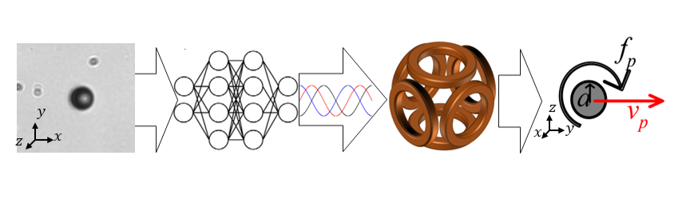

# Smart Magnetic Microrobots Learn to Roll With Reinforcement Learning

### Abstract
Accurate control of micron-scale robots, or microrobots, requires addressing unique challenges, including the difficulties associated with achieving motion in a non-inertial fluid dynamics regime, the development of real-time control strategies, and the presence of complex and dynamic environments. Unlike their macroscopic counterparts, microrobots are subject to Brownian motion, which randomizes their position and orientation. Reinforcement learning is a promising tool for autonomously developing robust controllers to create smart microrobots, providing them with the capability to adapt their behavior to operate in uncharacterized environments without the need to model system dynamics. In this work, we report the development of smart magnetic-driven spherical particles that harness lubrication forces to roll on a substrate. We use real-time control of these rollers to train a deep reinforcement learning model that generates an actuation policy to direct their motion in a simple standard navigation problem whose optimal solution can be derived from the underlying physics. The model's performance is analyzed under different sets of physical-informed system states. As a hallmark of the microscopic world, we characterize the influence of Brownian motion on the learning process by comparing learning rate at different Peclet numbers. Although the field of microrobotics has not yet reached the evolutionarily honed refinement of microscopic living organisms, deep reinforcement learning is a promising approach that is likely to enhance the capabilities of the next generation of microrobots.

*Schematic representation of the microrobot control process using deep reinforcement learning. From left to right: microscope image input, deep neural network for policy learning, rotating magnetic field actuation, and resulting roller motion.*

### Paper
For more details, see our paper draft [here](docs/draft.pdf).

### Overview
This repository contains the implementation of a reinforcement learning approach for controlling magnetic microrobots, including:
- Real-time control system using OpenAI Gym environment
- Deep RL implementation with Soft Actor-Critic (SAC)
- GUI interface for manual control and visualization
- Performance analysis at different Peclet numbers

### Contact
David Gonzalez-Calatayud: david.gonzalez-calatayud@estudiante.uam.es

